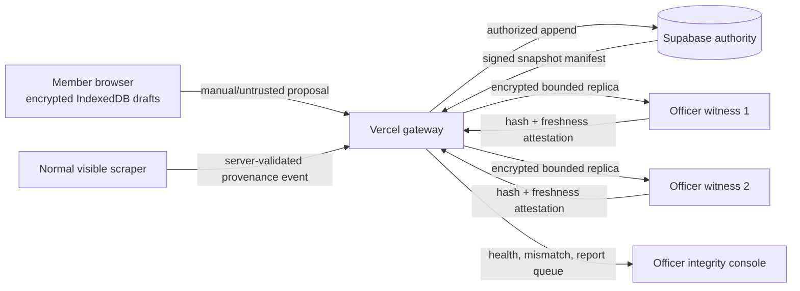

# Hybrid Trust, Device Storage, and Feedback Architecture

Status: architecture direction and development showcase. Officer peer replication is **not yet a
production capability**. Supabase remains the only authoritative day-to-day data store.

## 1. Outcome and non-negotiable boundary

The system may use powerful member and officer devices, but device ownership is not evidence of
truth. A browser, laptop owner, extension, malware process, or local administrator can change local
state. Therefore:

- **Supabase is authoritative** for authenticated profiles, paid membership state, scraper-ingested
  evidence, approved points, leaderboard source events, and audit records.
- **Vercel orchestrates** web requests, health/freshness checks, signed synchronization manifests,
  and bounded background dispatch. It does not ask a random peer which record should win.
- **Officer nodes may become encrypted replicas and integrity witnesses.** They compare signed
  manifests and report missing/stale/corrupt chunks. They do not accept arbitrary writes, expose
  plaintext member data, or silently inspect a member device.
- **Member devices may persist manual drafts locally.** Local/manual data never becomes verified
  without a server-owned source event or explicit review workflow.

## 2. Provenance states

Every fact needs an immutable origin and mutable review status; changing content creates a new
version rather than rewriting the source claim.

| State | Meaning | May affect verified ranks? |
|---|---|---|
| `manual` | Entered or edited on a member-controlled device | No |
| `scraped_pending` | Captured by an approved normal browser session; awaiting server checks | No |
| `scraped_verified` | Server accepted source, timestamp, hash, and normalized value | Yes, through approved point events |
| `officer_reviewed` | A named officer approved a bounded claim and audit event | Yes, according to policy |
| `superseded` | A newer version exists; historical record remains | No new effect |
| `disputed` | Hash, source, or review mismatch requires human resolution | No |

If a member edits a `scraped_verified` value locally, the edited copy is immediately a new `manual`
proposal. It does not inherit the verified tag. The original server record remains unchanged.

## 3. Local persistence

Use IndexedDB (not HTTP cache or `localStorage`) for persistent browser-owned drafts. Encrypt data
with Web Crypto using a non-exportable device key when supported. Store only the minimum needed,
include schema/version/expiry metadata, and expose **Export**, **Delete local data**, and **Disable
device vault** controls. Browser storage can still be deleted by the user, browser policy, storage
pressure, profile reset, or device loss; “persistent” is best effort, not a backup promise.

Do not place credentials, Supabase service keys, OAuth refresh tokens, raw cookies, payment details,
or officer replica keys in the application cache. Service workers must never cache authenticated API
responses unless a response is explicitly designed and encrypted for offline use.

## 4. Officer replica protocol (future phase)

1. Register an officer device after officer authentication, device-key generation, and explicit
   approval. A role change or reported device revokes it.
2. Supabase produces a monotonically increasing snapshot sequence and signed manifest containing
   schema version, chunk hashes, creation time, and previous-manifest hash.
3. Vercel announces only the latest signed manifest. Online officer witnesses report their stored
   sequence, chunk hashes, free capacity, and last successful verification.
4. A node fetches encrypted chunks from the authoritative export path or another node only after
   verifying the manifest signature. Peer content never wins solely by majority vote.
5. Vercel compares attestations. Hash disagreement, rollback, impossible future sequence, or stale
   heartbeat opens an officer incident. Supabase plus its managed backups remain the recovery root.
6. Quorum is a **monitoring signal**, not authorization. Two compromised laptops must not rewrite an
   authoritative record.

Recommended transport: WebRTC data channels only for encrypted chunk transfer, with Vercel as the
signaling/orchestration service. Prefer content-addressed encrypted blocks, per-node quotas, rate
limits, resumable transfers, and remote revocation. Never expose direct Postgres credentials to a
peer.

## 5. Feedback loop

The global **Report** action sends a small structured diagnostic: route, page title, viewport,
online state, allowlisted component identifiers, category, and optional user text. Automatic browser
errors are sent only when the user enables the setting. Error messages are truncated and common
emails/URLs are redacted.

Not collected by default: screenshots, raw HTML, DOM text, form values, cookies, tokens, Google
email, resumes, local cache content, or cross-origin page data. A future screenshot attachment must
show a preview and require a separate confirmation because screenshots frequently contain personal
information.

Useful additional loops:

- onboarding funnel: identity created → payment viewed → proof submitted → human activation;
- stale-data loop: Supabase snapshot age and officer witness freshness;
- integrity loop: source hash mismatch, local edit downgrade, duplicate claim, or clock anomaly;
- outcome loop: event attendance, evidence review latency, resume use, and job application result;
- privacy loop: export/delete requests, hidden-identity usage, revoked consent propagation time;
- reliability loop: Web Vitals, API errors, failed background jobs, and unresolved report age.

Metrics must be aggregate, retention-bounded, and never used to infer sensitive traits.

## 6. Known vulnerabilities and mitigations

| Vulnerability | Impact | Required mitigation |
|---|---|---|
| Member changes browser/IndexedDB data | Fake or altered manual claims | Treat client data as proposals; server validation; provenance downgrade on edit |
| XSS or malicious extension reads local drafts | Privacy loss | CSP, output encoding, dependency audit, encryption at rest, minimal retention |
| Officer laptop compromise | Replica disclosure or false attestation | Encrypted chunks, non-exportable key, revocation, least-data replicas, no DB credentials |
| Majority of witnesses collude | False quorum signal | Supabase-signed manifests remain root of truth; quorum never authorizes writes |
| Stale/offline peer advertises old data | Rollback/confusion | Monotonic sequence, expiry, previous-hash chain, freshness threshold |
| Vercel account compromise | Bad orchestration or UI deployment | protected deployments, MFA, signed manifests from separate key boundary, audit alerts |
| Supabase service-role key leak | Full authority compromise | server-only secret, rotation, scoped functions, no browser exposure, incident playbook |
| Feedback text or screenshot leaks PII | Privacy breach | structured diagnostics, redaction, attachment preview + separate consent, retention limits |
| Payment-proof storage leaks financial data | Financial/privacy harm | private bucket, short retention, officer-only review, never store account credentials |
| Officer covertly inspects member cache | Insider abuse and loss of trust | prohibit by architecture; explicit member export/consent; immutable officer access audit |
| Browser storage eviction/device loss | Lost manual drafts | export/backup controls; clear best-effort persistence warning |
| Scraper account/session challenge | Availability and account risk | normal visible browser, human verification, bounded cooldown; never bypass anti-bot controls |

## 7. Staged rollout

1. **Current:** Supabase authority, RLS/RPC projections, local synthetic demo, privacy-safe feedback,
   anonymous ranking, and officer-reviewed membership.
2. **Device vault:** IndexedDB encryption, schema migrations, export/delete, storage-persistence request,
   and provenance downgrade tests.
3. **Replica witness pilot:** two officer devices, synthetic/non-sensitive encrypted snapshots only,
   signed manifests, revocation, corruption and rollback drills.
4. **Bounded production replication:** privacy impact assessment, threat-model review, key recovery,
   incident response, retention policy, capacity quotas, and explicit chapter approval.

No peer replication should ship until the human review gate validates the threat model, privacy
notice, device revocation, corruption recovery, and officer offboarding flow.
