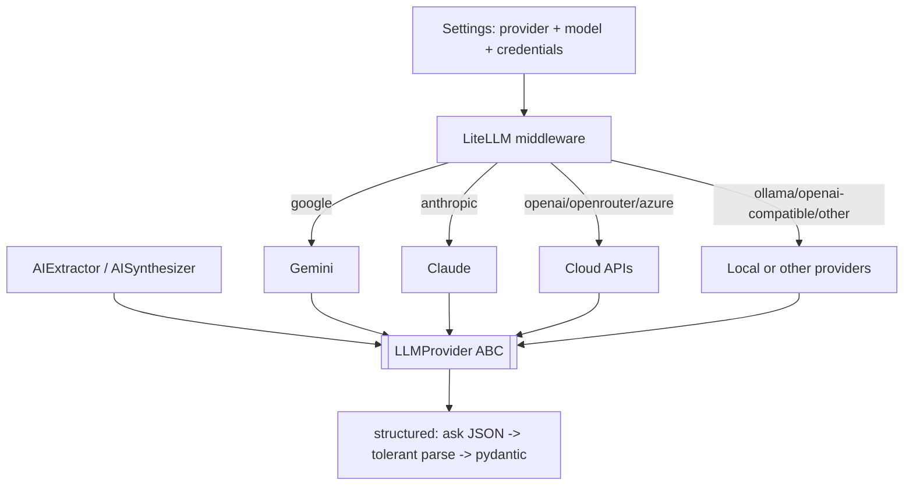

# `llm/` — Provider-Agnostic LLM Layer

One interface, many providers. Pipeline stages depend only on the `LLMProvider` ABC; choosing a
provider is a registry concern, not a stage concern. Part of **Department 03 (Intelligence)**.

> 📖 [Dept 03 — Intelligence](../../../../docs/departments/03-intelligence/README.md)

## Contract

```python
class LLMProvider(ABC):
    name: str
    def complete(self, prompt: str, system: str | None = None, max_tokens: int = 1024) -> str
    def structured(self, prompt: str, schema: type[T],
                   system: str | None = None, max_tokens: int = 2048) -> T
```

## Selection + call flow



## Files

| File | Role |
|---|---|
| `base.py` | `LLMProvider` ABC + tolerant JSON parser + `LLMUnavailableError` |
| `registry.py` | `get_provider()` factory (settings/env driven) |
| `local_config.py` | User-managed local secret store, masked readiness, and shared runtime gate |
| `litellm_provider.py` | Unified provider/model routing and normalized completion responses |
| `anthropic_provider.py` | Claude API |
| `openai_provider.py` | OpenAI-compatible HTTP API; remote or locally hosted server |
| `claude_session_provider.py` | Development-only interactive fixture; not in runtime registry |
| `null_provider.py` | No-op for `static` mode |

## Rules

Never import a concrete provider in a stage — use the ABC. No hardcoded keys (read from
settings/env). Add a provider by subclassing + registering. `structured()` has a default
(JSON + tolerant parse); override only for native tool-use APIs.

Production AI execution must cross an HTTP API boundary. Configure
`RESUME_LLM_API_BASE_URL`, `RESUME_LLM_API_KEY`, and `RESUME_LLM_MODEL`; a local model is supported
only when it exposes the same API contract. The current Codex/Claude chat session may generate
fixtures during development, but it is not embedded in or selectable by the shipped system.

The product Settings page writes one normalized contract to the ignored `var/state/local-ai/config.json`
file with owner-only permissions. LiteLLM translates that contract for Google Gemini, Anthropic
Claude, OpenAI, OpenRouter, Azure, Ollama, OpenAI-compatible servers, and full LiteLLM provider
routes. API keys are passed per request instead of mutating process-wide provider environment
variables. Reads expose only endpoint/model metadata and whether a key exists; the key value is
never returned. Resume generation, UpSkill, and scraper-connected execution all fail closed at the
shared configuration gate.

The local DAG workbench exposes full-run and standalone-node testing for access, rendered scraping,
structured AI output, strict package validation, department-review handoff, email-draft JSON, and
email readiness. It never executes the external email-delivery node.
