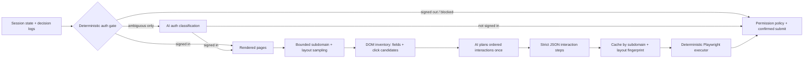
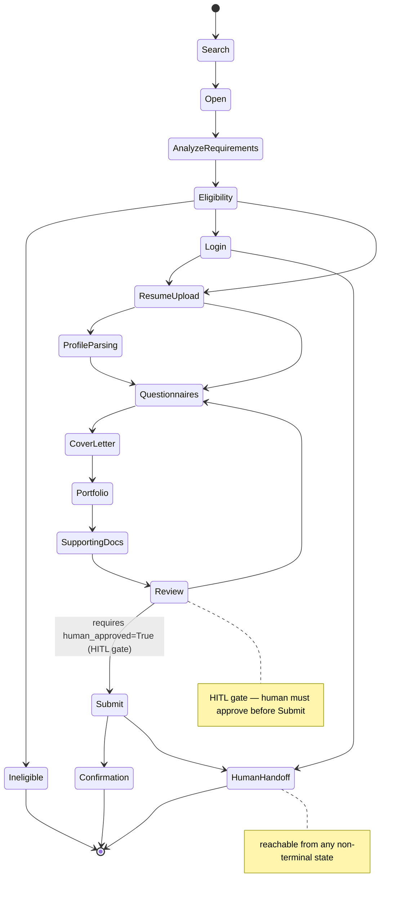

# `job_application/` — Job Application Expert

Contract and logic layer for automating job-application form filling. Defines the
schema for an `ApplicationPlan`, the canonical field taxonomy ATS forms map to,
the state machine that governs the application workflow, and helper utilities that
translate NCD (Normalized Candidate Data) values into detected form fields.

The package includes the structure-learning boundary and browser execution:
bounded subdomain/layout sampling, rendered DOM inventories with explicit non-link
`click_candidate` tags, and an AI-generated ordered interaction plan. The deterministic
Playwright execution now supports dynamic reveal/fill steps, evidence-grounded AI answers, scoped
permissions, validation, bounded retry, confirmed submission, and an idempotency ledger. ATS vendor
fingerprints and Action-RAG recovery remain deferred.

Website-agnostic checks live in `shared/`: access/challenge classification, final-submit readiness,
and configurable role-to-resume artifact scoring. Generic execution and site adapters consume
these primitives. Site modules retain only verified DOM selectors, routes, and workflow semantics;
new websites configure the shared library instead of copying CAPTCHA, submit, or resume-selection
logic.

## Conceptual package map

The directory tree names decision boundaries so it can be read as a compact architecture:

```text
job_application/
├── shared/        # website-agnostic access, resume, and final-submit gates
├── intelligence/  # evidence-grounded answer decisions; no browser or database ownership
├── persistence/   # durable validated knowledge; no answer or click decisions
├── runtime/       # machine-capacity limits; no vendor selectors or application data
├── indeed_*.py    # verified Indeed adapter and workflow semantics
├── executor.py    # deterministic browser effects under permission gates
├── permissions.py # domain-scoped authority boundary
└── models.py      # contracts shared across the layers
```

Imports from `resume_builder.job_application` remain the stable public API. Callers should use that
facade unless they are extending one specific conceptual layer.

`ApplicationBatchCoordinator` provides bounded parallel orchestration for isolated application
workers. Each worker must own its browser page; Playwright pages are never shared across threads.
Successful no-CAPTCHA flows may continue to observable confirmation, while CAPTCHA results collect
as `verification_pending` items in the thread-safe `HumanVerificationQueue`. One worker failure
fails only that task closed and never enables retries or submission for another task.
For Indeed, `reconcile_indeed_post_apply` deterministically recognizes the exact post-apply route
plus visible `Your application has been submitted!` proof. It records the SQL confirmation and
resolves the matching CAPTCHA queue item, allowing that worker slot to return to job search.
Every batch task carries an explicit target country and `remote|hybrid|onsite|any` work mode. The
coordinator rejects a worker result that changes either value, so a foreign-country remote search
cannot silently become a Philippines-targeted or onsite application.
When configured with `CountrySelectionPolicy`, the coordinator also rejects any task outside the
human-selected country allowlist and requires remote mode. Home-country exclusion is optional, not
implicit. Phone/contact country codes remain truthful profile data and never participate in this
decision.

Authentication is session-first. The pipeline checks access blockers, visible signed-in/signed-out
DOM markers, stored Playwright state, and recent non-secret session-decision logs before considering
an AI call. AI is an ambiguity fallback only; cookie values and credentials never enter its prompt.
Login/sign-up walls, expired/unknown sessions, CAPTCHA, and verification stop for human handoff.
`check_access_gate` performs this check deterministically; it never solves or bypasses a challenge.
`HumanVerificationQueue` can persist blocked applications using only a redacted application
reference, domain, query-free URL, reason, timestamps, status, and the non-secret Chrome target ID
needed to resume the exact handoff tab. After the user completes the challenge in the same
legitimate browser session, a clear recheck resolves the queue item and the normal runner can
resume. Cookies, credentials, storage state, proxy rotation, fingerprint spoofing, solver services,
and other anti-bot evasion are outside this pipeline.

Confirmed submissions are stored separately in `ApplicationSubmissionHistory`, backed by SQLite.
Before a final click, the runner atomically checks normalized-exact company and job-title keys. A
confirmed match from the previous 30 days is skipped; a recent unresolved attempt also stops to
avoid an accidental double submission. A different exact title at the same company remains
eligible, and the same role becomes eligible again after the 30-day window. Employer lifecycle
states such as accepted or rejected are not tracked. Confirmation evidence is provider-neutral:
the browser can confirm immediately, the user can confirm manually, or a future email adapter can
implement `SubmissionConfirmationProvider`. Provider reconciliation runs at the end of the flow.
The database keeps the displayed company/title, UTC application time, query-free source URL,
redacted confirmation and its source, plus an audit row for each safety decision.

## Local Job Finder Control Center

Start the FastAPI prototype and open `/job-finder-control` for the standalone browser companion.
It keeps automatic batch work separate from grouped human interventions, shows the existing
identity/social sessions plus Indeed, and can focus the exact Chrome/CDP tab recorded in the
privacy-safe verification queue. CAPTCHA, human verification, sign-in, unknown questionnaire,
and external-site work remain normal visible-browser handoffs; the page never solves a challenge
or expands submission permission.

The control page reads `.cache/application-verification-queue.json` and the newest
`out/indeed-unattended/**/run.json` by default. Set `JOB_FINDER_VERIFICATION_QUEUE` when the runner
uses another queue path. Disconnect behavior is chosen by the user and remembered only in browser
local storage; Settings can restore the default “ask every time” behavior.

## Dynamic website planning



Clickable `div`, `role=button`, tabs, accordions, expanders, modal openers, and same-page
panels are first-class interaction candidates—not discarded because they lack an `<a href>`.
Every planned interaction records selector, purpose, expected state change, and an optional
`wait_for_selector`. Final submit is schema-guarded with `requires_human=True`.

The planner also emits executable `dom_rules` for whole questionnaire/component containers and
each nested field. This supports company-specific forms where both the number of questions and the
div/component nesting vary. Saved-resume choices, upload/replace controls, and work-mode choices are
distinct roles; missing controls are reported as warnings rather than invented selectors. Resume
selection/upload and Continue remain previewable human gates.

Indeed Smart Apply has a deterministic module planner for the verified contact, location, resume,
relevant-experience, review, and post-apply routes. Contact names are reconciled against the
selected resume. Each contact field is checked before editing, so matching values remain untouched.
Phone comes only from the runtime-verified contact profile, is normalized against a separate
country-code control, and is never inferred, generated, or hardcoded. When a foreign application
locale preselects another phone country, the adapter replaces it only from an explicit
runtime-verified ISO country code before filling the national number. Missing verified contact
data stops before Continue. Resume upload and resume Continue are separate approvals;
achievements, leadership, and projects never substitute for professional experience; final submit
still requires its own explicit approval.

`run_indeed_smart_apply_until_gate` composes those one-module plans into a bounded sequential run.
It re-observes the page after every Continue, stops on access/layout drift, and returns at resume
preview, missing/sensitive data, review, or final-submit gates. Reaching Review is not permission to
submit; unattended repeat runs still require an explicit domain-scoped `autonomous_submit` policy.
Navigation checks use bounded polling so delayed URL changes and short-lived hydration shells do
not trigger duplicate clicks or stale-page actions; an unresolved transition still fails closed.
Employer questionnaires accept only an evidence-grounded `QuestionPlanningResult`. The runner
validates required answers, advances one questionnaire page, then requires fresh inventory and
planning if another question page appears.

`HybridQuestionPipeline` keeps standard questions deterministic. It maps selected-resume facts
(name, education, graduation state, professional experience, links) and explicitly verified
runtime profile facts (email, phone, street/city/region/postal/country) without a model call.
Missing private facts, salary, authorization/visa, unset preferences, scheduling, consent, and
demographic questions stop for human input. Only non-standard employer questions such as project-
or technology-specific experience may call the bounded career-evidence answerer. That answerer
receives only resume evidence with a positive token match and must still cite accepted evidence IDs
or abstain.

The unattended Smart Apply runner adds a MongoDB-first adaptive question bank. It resolves each
rendered page in this order: exact saved page, reusable normalized-label answer, selected-resume or
runtime fact, then a structured-output model call only for a new bounded career-evidence question.
Validated non-private answers are upserted into MongoDB for later pages. Session-only phone, email,
address, compensation, authorization, legal, and demographic values are never added to the
reusable bank. Explicit preferences live separately in the `application_profile` MongoDB
collection, so answer values are data rather than source-code constants.

Novel question responses use this strict JSON contract:

```json
{
  "schema_version": 1,
  "question_id": "observed-field-id",
  "decision": "answer",
  "answer": "Concise, truthful, professional answer",
  "confidence": 0.9,
  "evidence_ids": ["project:observed-id"],
  "rationale": "Brief evidence-grounded reason",
  "reusable": true,
  "sensitivity": "standard"
}
```

`decision` is `answer`, `abstain`, or `human_required`; `sensitivity` is `standard`, `personal`,
`legal`, `compensation`, or `authorization`. The runner validates IDs, evidence citations, exact
options, and field length before accepting or saving an answer. Configure the API key only in the
process environment (`GOOGLE_API_KEY` or `GEMINI_API_KEY`) and select the model with
`--question-ai-model`; the key is never written to CLI arguments, MongoDB, logs, or run artifacts.
Each questionnaire page emits a masked `questionnaire-pages.jsonl` record containing the known
profile context and saved/new answer sources.

For a non-mutating live preview against a user-approved Chrome/CDP session:

```bash
python tools/job_finder/application_cdp_tag.py inventory
# Development-only current-session rules, or strict rules returned by the configured API:
python tools/job_finder/application_cdp_tag.py apply --rules out/live-indeed-application/rules.json
```

The preview never fills fields, uploads a resume, clicks Continue, or submits an application.

## Bounded Indeed batch

Job discovery and application execution remain separate commands. The deterministic collector uses
the live Indeed search controls, enforces `remote`, searches only the human-selected Australia and
Canada hosts, removes recent exact duplicates, rejects senior or mismatched titles, and writes a
reviewable manifest:

```bash
python tools/job_finder/collect_indeed_candidates.py \
  --target-country Australia \
  --target-country Canada \
  --employment-type contract \
  --max-candidates 12 \
  --output out/indeed-unattended/candidate-manifest.json
```

`--employment-type contract` first selects Indeed's visible **Job Type → Contract** search filter.
If the current rendered search does not offer that option, the query yields no candidates rather
than broadening to another job type. It also adds a fail-closed qualification group to every
candidate: the application runner must observe an explicit `contract`, `contractor`, or
`fixed-term` signal in the rendered job title/description before it can open Apply. Unspecified or
permanent roles are skipped.

The bounded scheduler then consumes that manifest with three independent CDP pages. Final Submit
remains disabled unless `--autonomous-submit` is present. If `--verified-phone` is omitted, the
runner may preserve the visible saved Indeed number only when the separate country control exactly
matches the explicitly supplied ISO country. Missing or mismatched contact data stops before
Continue.

Verified identity and resume routing are structured SQLite configuration, not Python constants.
By default they share `.cache/application-submissions.sqlite3` with the confirmation ledger; use
`--profile-database` to separate them. Resume PDFs and evidence JSON remain files under the approved
artifact directory. Only their basenames and editable matching terms are stored in SQL.

```bash
python tools/job_finder/configure_application_profile.py profile \
  --first-name "Verified First" \
  --last-name "Verified Last" \
  --country-name Philippines \
  --country-iso PH \
  --phone-calling-code +63

python tools/job_finder/configure_application_profile.py resume-route \
  --filename software-systems.pdf \
  --term "software engineer" \
  --term backend \
  --default

python tools/job_finder/configure_application_profile.py show
```

The runner overlays the verified SQL name and country onto the selected resume at execution time.
An explicit manifest `resume_file` still wins; otherwise current title/description terms select a
configured route. With no matching route and no configured default, execution stops for human
review. The phone itself remains optional and is not stored unless explicitly passed to the profile
command; the private environment or runtime flag continues to take precedence.

For a user-approved saved contact number on a foreign-locale form,
`--use-saved-contact-phone` uses that visible runtime value and reconciles the separate country
control to the explicit `--phone-country-iso`. `--process-all-candidates` exhausts the bounded
manifest rather than stopping after the confirmation target. External or missing Indeed Smart
Apply controls are skipped. A worker closes its page only after a terminal `skipped` outcome or
deterministic submitted confirmation; verification, validation, questionnaires, and unknown
submission outcomes remain open for human recovery.

If the foreign form embedded its old calling code inside the saved visible value,
`--saved-phone-original-calling-code` must be the prefix observed in that form. The runner strips
that exact prefix before applying `--phone-country-calling-code`; it never guesses or rewrites the
remaining national number. When the form still exposes its original foreign country control, the
runner can read that visible calling-code prefix directly for the same normalization.

Literal qualification checks combine the exact rendered job title with the full description. This
allows an explicit title such as `(Fully Remote)` to satisfy the remote requirement without
silently broadening a role whose title and description contain no remote evidence.

To resume an already-open application while processing every relevant current Indeed tab, merge a
reviewed seed manifest with the live tabs before launching:

```bash
python tools/job_finder/collect_indeed_candidates.py \
  --target-country Australia \
  --target-country Canada \
  --open-tabs-only \
  --seed-manifest out/indeed-unattended/candidate-manifest.json \
  --max-candidates 24 \
  --output out/indeed-unattended/all-current-manifest.json
```

```bash
python tools/job_finder/run_indeed_unattended.py \
  --manifest out/indeed-unattended/candidate-manifest.json \
  --artifact-dir /path/to/approved/resume-artifacts \
  --target-submissions 3 \
  --max-parallel 3 \
  --max-candidates 12 \
  --resource-mode auto \
  --max-tabs 0 \
  --verification-wait-minutes 180 \
  --phone-country-calling-code +63 \
  --phone-country-iso PH \
  --autonomous-submit
```

`--resource-mode auto` reads live available RAM, swap use, logical CPUs, and physical cores before
the batch starts. It clamps `--max-parallel`, `--max-candidates`, and the calculated tab budget.
Swap pressure of 512 MiB or more forces one browser worker. `--max-tabs 0` selects the calculated
limit; an explicit value is still treated as a ceiling. The chosen limits and resource snapshot are
written to `run.json`. Before opening a listing or triggering an Apply transition, the runner checks
the live browser-context page count; work is deferred when the tab ceiling has been reached.

Listings whose **Apply on company site** control opens an external application are not automated.
The external tab stays open and is added to the verification queue with
`group=human_intervention` and `reason=apply_on_company_site` for manual completion.
For Indeed's “Which location are you applying for?” question, the runner reads the exact location
from the current Smart Apply job header and validates that value against the live select options;
it never reuses a fixed city from another job.

## Workflow state machine



## Files

| File | Role |
|---|---|
| `models.py` | `ApplicationPlan` schema — platform, workflow, fields, documents, HITL gate |
| `field_taxonomy.py` | `CANONICAL_FIELDS` dictionary + `normalize_label` + `JUDGMENT_FIELDS` |
| `state_machine.py` | `STATES`, `TRANSITIONS`, `WorkflowStateMachine` with HITL-guarded transition |
| `field_mapping.py` | NCD→field helpers: `build_detected_field`, `total_years_experience`, `degree_to_enum` |
| `website_planner.py` | subdomain/layout sampler + interactive DOM inventory + AI step planner |
| `session_check.py` | access + session-log + DOM auth gate; AI ambiguity fallback; planning coordinator |
| `access_verification.py` | deterministic CAPTCHA/access checker + non-secret human queue |
| `submission_history.py` | SQLite exact company/title history, 30-day guard, and audit log |
| `indeed_smart_apply.py` | deterministic Indeed module classification, field/resume planning, and human gates |
| `indeed_smart_apply_runner.py` | bounded sequential execution with access, permission, and transition checks |

## Contracts / key signatures

```python
# models.py
class ApplicationPlan(BaseModel):
    platform: PlatformInfo
    workflow: WorkflowInfo
    detected_fields: list[DetectedField]
    required_documents: list[RequiredDocument]
    missing_information: list[MissingInformation]
    upload_strategy: UploadStrategy | None
    browser_actions: list[BrowserAction]
    validation_steps: list[ValidationStep]
    recovery_plan: list[RecoveryRule]
    hitl: Hitl  # stop_before MUST be "Submit" — enforced by model_validator

class Hitl(BaseModel):
    stop_before: str = "Submit"   # any other value raises ValueError at construction
    status: str = "awaiting_human_review"

# field_taxonomy.py
CANONICAL_FIELDS: dict[str, list[str]]  # 19 canonical keys → variant label lists
JUDGMENT_FIELDS: frozenset[str] = frozenset({"salary", "work_authorization", "visa_sponsorship"})

def normalize_label(label: str) -> str | None: ...   # longest-match variant → canonical key
def is_judgment_field(canonical: str) -> bool: ...

# state_machine.py
STATES: tuple[str, ...] = (
    "Search", "Open", "AnalyzeRequirements", "Eligibility", "Ineligible",
    "Login", "ResumeUpload", "ProfileParsing", "Questionnaires", "CoverLetter",
    "Portfolio", "SupportingDocs", "Review", "Submit", "Confirmation", "HumanHandoff",
)
class WorkflowStateMachine:
    def next_states(self, state: str) -> set[str]: ...
    def can_transition(self, a: str, b: str) -> bool: ...
    def transition(self, current: str, target: str, *, human_approved: bool = False) -> str: ...

# field_mapping.py
def build_detected_field(canonical: str, label: str, kind: str,
                         required: bool, ncd_value: str | None,
                         ) -> DetectedField | MissingInformation: ...
def total_years_experience(spans: list[tuple[float, float]]) -> float: ...
def degree_to_enum(degree: str, options: list[str]) -> str | None: ...
```

## Permission gate

Plans retain a conservative human-review marker. Runtime users can explicitly enable a
domain-scoped `autonomous_submit` permission; this never skips access checks, validation,
idempotency, or observable confirmation.

Two enforcement points preserve the default:

1. **Schema level** — `ApplicationPlan.hitl.stop_before` is validated by a Pydantic
   `model_validator`; any value other than `"Submit"` raises `ValueError` at plan creation.
2. **State machine level** — `WorkflowStateMachine.transition("Review", "Submit")` raises
   `ValueError` unless `human_approved=True` is explicitly passed.

The executor accepts only a scoped `ApplicationPermissionPolicy`, not a global safety-off switch.

## Judgment fields

Fields in `JUDGMENT_FIELDS` (`salary`, `work_authorization`, `visa_sponsorship`) are never
auto-filled. `build_detected_field` unconditionally returns a `MissingInformation` record
for them, escalating the decision to the human regardless of what NCD data is available.

## What is deferred

- **ATS detection** — vendor fingerprinting from platform evidence
- **Action-RAG** — retrieval-augmented recovery from application errors

The schema and state machine defined here are the contracts those components will implement.
